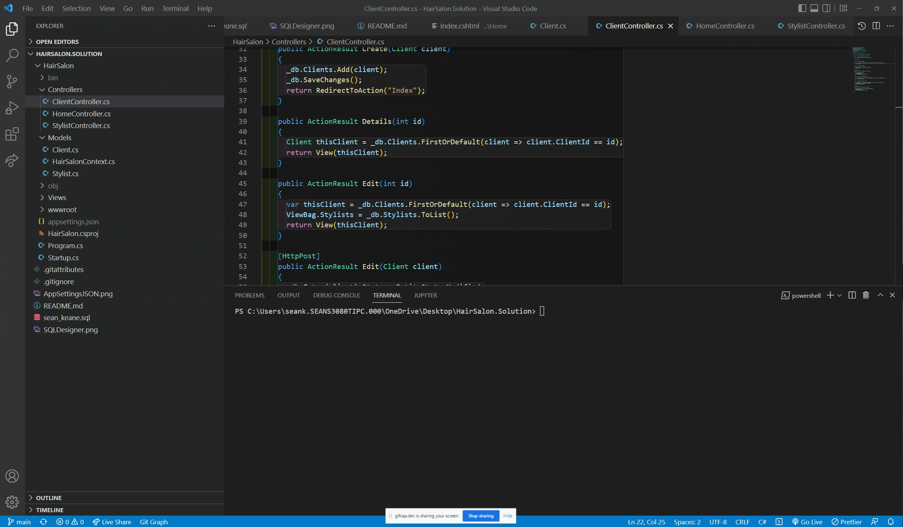
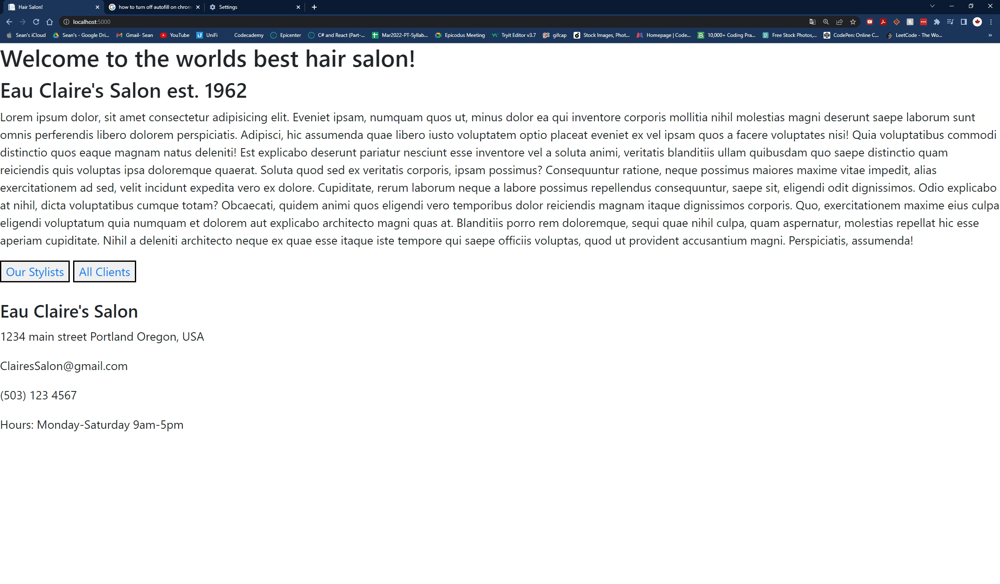

# _Database Basics_

#### By _**Sean Keane**_

#### Eau Claire's Hair Salon - Epicodus Code Review 7/29/2022

## Technologies Used

* C#
* .NET 5.0
* ASP.NET Core MVC
* MySQL
* Entity Core Framework

## Description
_This is a project I created at Epicodus that allows Eau Claire's Hair Salon to input both Stylists and Clients into a database using MySQL.  The user is presented with a "Splash Page" and has the options of selecting Stylists or Clients. The user has the ability to add the name of the stylist, their speciality, and the ability to edit this information. They also can enter client names, descriptions, assign a stylist, and edit this information.  Developing this application helped grow my understanding of C#, .NET, ASP.NET Core MVC, Databases, and Entity Core Framework._

## Schema
_This is an illustration of the relationship between the two tables used in this application._

## Setup/Installation Requirements

1) Clone this repository to your desktop.
2) Navigate to the now installed directory and open in your editor of choice.
3) Create your own database using the data from `sean_keane.sql`.  Import this data into your MySQL workbench.

4) Create a new file within the HairSalon directory.  Use the command `touch appsettings.json`
5) In the appseetings.json please create your own entry points (Your database, userId, and password within appsettings.json).
6) Open the directory and `cd to HairSalon`.
7) To build the Hair Salon enter: `dotnet build`.
8) To run the Hair Salon enter: `dotnet run`.
9) Open your browser of choice and use the url: http://localhost:5000/

## For a visual representation of setup and a successfully built application, please consult the attached Gifs.

## Project can be found at:
https://github.com/CanadianRunner/HairSalon.Solution.git

## Known Bugs

* This application currently has limited styling. If time permits I would like to add some more visual appeal to this application.

## License

If you have any questions or concerns feel free to contact me at code@sean-keane.com

*This is licensed under the MIT license*

Copyright (c) 7-29-2022 **_Sean Keane_**

